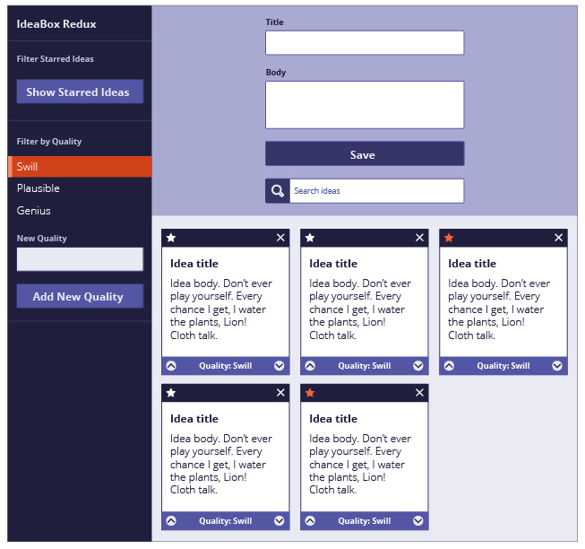

Ideabox allows users to create an Idea Card that will be saved on local storage and persist on reload.  The user can both
favorite an idea and assign an idea quality. The user is also able to filter through ideas by idea quality and whether it is favorited.

Technologies Used:
1. Vanilla JS
2. CSS Flexbox
3. CSS Grid

Comp.

